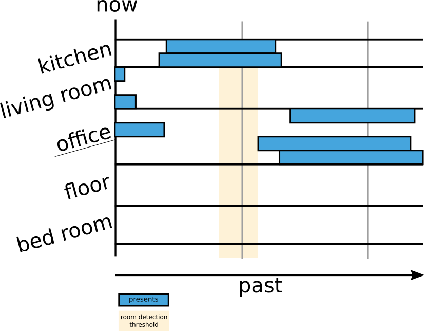

# light-control

[Mqtt](http://mosquitto.org/man/mqtt-7.html)
light-control for [singles](https://en.wikipedia.org/wiki/Single_person).
It comes with with room tracking, which works best if one person lives alone.

## How to install

```shell script
cargo install install --path .
```

## How to run

```shell script
export RUST_LOG=light_control=info
~/.cargo/bin/light-control examples/home.json
```

## Overview

Here is a small overview on how an light-control sees your sensors



The threshold is the time threshold that need to be reached by an other room,
before we detect the other room as the current presents of the user.

## Configuration File

Should be simple.
light-control knows

* sensors : generate presents input
* switches : receive on off commands (incl brightness and rgb information)
* scenes: day, night or outside

> Have a look at [./examples/home.json](./examples/home.json) to get an impression.

### How find key and topic

You can use the mosquitto client to subscribe to all messages

```shell script
mosquitto_sub -v \
  -u light-control \
  -P password \
  -h localhost \
  -t "#"
```

This would be a line you see:
```mqtt
zigbee2mqtt/motion_sensor_7 {"battery":100,"voltage":3015,"linkquality":99,"occupancy":true}
```
* `zigbee2mqtt/motion_sensor_7` is the topic
* `occupancy` is the key describing the state

> light-control only excepts messages in flat json

### Sensors

* `topic`: topic to listen to.
* `key`: json key to read the state.
* `room`: that should be considered present if this sensor is triggered.
* `invert_state`: (default false) 
    sometimes sensors send false if presents is detected.
    This option is to invert the state in that cases.
* `delay`: (default 60) 
    how long to wait (in seconds) till a present state becomes 
    absent after the devices publishes the absent message.
    
### Switch

* `topic`: topic to listen for state.
* `key`: json key to read the state.
* `rooms`: rooms to which switch react.
* `delay`: 
    how long to wait, in seconds, till the switch is turned off
    once all subscribed rooms become absent.
* `command`: command control.
    * `command`: turn on and off command
        This is a mustache template. Injected arguments are:
        * state : on/off (see on/off statement)
        * brightness : 0 - 255
    * `init_command`: (default null)
        command to get state of the device
        will be triggered at program start.
    * `topic`: topic to send commands
    * `on`: (default "ON")
        string to send for state argument to run switch on
    * `off`: (default "OFF")
        string to send for state argument to run switch off
        
### Scene

> The first scene in the one chosen after program start.

* `name`: name of the scene
* `brightness`: brightness level for this scene
* `disable_switches`:
    list all switch topics which should be turned off.
* `enable_switches`:
    list all switch topics which should be turned on.
* `ignore_switches`:
    list all switch topics which should not be set.
* `room_tracking_enabled`: tracking enabled or not

## Interact via mqtt

Mqtt is the perfect place to control light-control.

### How to change scenes

```shell script
mosquitto_pub \
  -h localhost \
  -u homeassistant \
  -P password \
  -t "control/lights/set" \
  -m '{"scene":"<scene-name>"}' 
```
